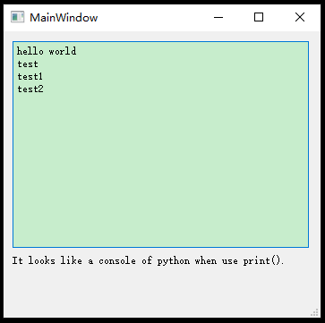

# Python_Print_to_PyQt5_textBrowser
- Python print()
- PyQt5 QTextBrowser

Let the text which printed in Python console to show in textBrowser in QtMainWindow.

Such as:
```c
print("Hello World")
print("test")
print("test1")
Print("test2")
```

